# Binary, bits and bytes

## Data
**Anything** is, somehow, just data. It can be *very long* data, such as all the data to describe a person, or it can be *very short*, such as the age of someone.

Let me just remind you something simple. We still today store information in books and we need two *formulas* for this storage:
- The **writing** formula, that we learn at school
- The **reading** formula, that we also learn at school

Now let's talk about raccoons. An image is data. With the appriopriate conversions and conventions, it can actually be expressed as a very long number.
Take this picture

Similarly to books, this raccoon can be stored with:
- A formula converting all the colors and all the geometry in a big number that we name **N**
- A formula converting **N** back in the original picture

This big number **N** is the image in its "number" format.

## Our lovely decimals and our two hands
Let's start easy.

[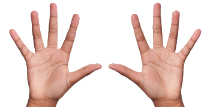]()

These are **two hands**. You probably still count on them from time to time.

Have you ever wondered why we count from 0 to 9 and then we go on from 10 to 19, 20 to 29 and on and on?

Well that's because we have *10 fingers* on our two hands.

[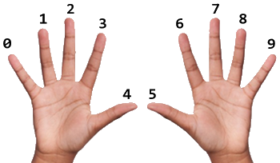]()

We would have these hands:

[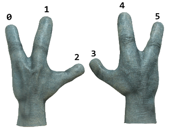]()

Then we most likely would count in **penta**mal instead of **dec**imal, like that:
0, 1, 2, 3, 4, 5, 10, 11, 12, 13, 14, 15, 20, 21 ...

## Binary
Binary is strange. Why not stick to our 10 fingers?

Because computers were and **are still** made of a lot of these:

[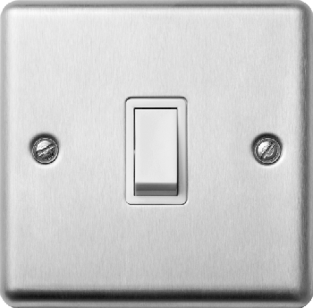]()

If you need more explanation, here is our favourite hand:

[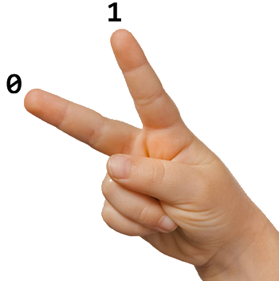]()

We use 0, 1, 2, ..., 9. Computers use this way less fashion **0** and **1**.
That's because electricity is easily turned off or on, matching the 0 or the 1.
Plus you can surprisingly do pretty much everything with a lot of 0s and 1s.

Going a bit more in depth, a computer is made of these:

[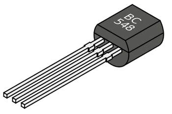]()

That's a transistor we now use for example in *electronic toys*. 
Transistors work thanks to physics and chemistry...

[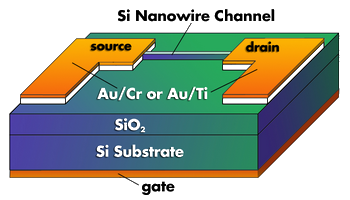]()

Depending on electricity in one of their 3 pins (inputs):
- they will let the current go through them - that gives the **1**
- they won't - that gives the **0**

Now these *transistors * are nanometric and look more like these:

[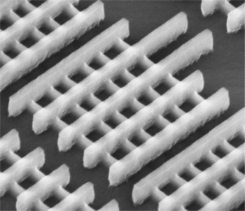]()

But in the end, they are just billions of these all interconnected:

## Bits
You've heard of *digits*?
Well **bits** are the binary version of *digits*.

A digit can be: 0, 1, 2, 3, 4, 5, 6, 7, 8, 9
A bit can be: 0, 1

Now computers tend to process bits in chunks, not one by one anymore.

We, humans, do the same: we do not only use digits but we also use *numbers* to go faster.
For example: 234 = 2 x 10^2 + 3 x 10^1 + 4 x 10^0 = 2 x 100 + 3 x 10 + 4 x 1 = 234

The same works for binary, but it's on a **base 2** instead of a **base 10** so for example:

[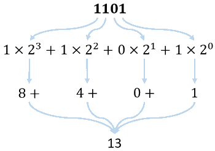]()

Going further with this method, we count as shown in this table:

| Binary | Decimal | Pental (5) | Octal (8) |
| ------ | ------- | ---------- | --------- |
| 0000   | 0       | 0          | 0         |
| 0001   | 1       | 1          | 1         |
| 0010   | 2       | 2          | 2         |
| 0011   | 3       | 3          | 3         |
| 0100   | 4       | 4          | 4         |
| 0101   | 5       | 10         | 5         |
| 0110   | 6       | 11         | 6         |
| 0111   | 7       | 12         | 7         |
| 1000   | 8       | 13         | 10        |
| 1001   | 9       | 14         | 11        |
| 1010   | 10      | 20         | 12        |
| 1011   | 11      | 21         | 13        |
| 1100   | 12      | 22         | 14        |
| 1101   | 13      | 23         | 15        |
| 1110   | 14      | 24         | 16        |
| 1111   | 15      | 30         | 17        |

## Bytes
A byte is just **8 bits**. So it could 10010111 for example.

Why? **History** and **alphabet** mostly.

This thing

[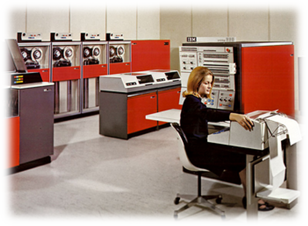]()

back in the days introduced the byte. 
We also realised that our alphabet and all the necessary symbols could be contained in *8 bits* - or a **byte** - because of the 2^8 = 256 possible combinations.

Plus this Intel thing back in the 70s

[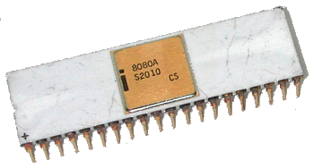]()

made the 8 bit famous. And we kept using the *byte* since then really.

Today we measure a lot of things in **bytes** such as data storage size, although we keep using **bits** for internet speeds for example.
Note that today, most of the CPUs are not 8 bit anymore, but 64 bit.