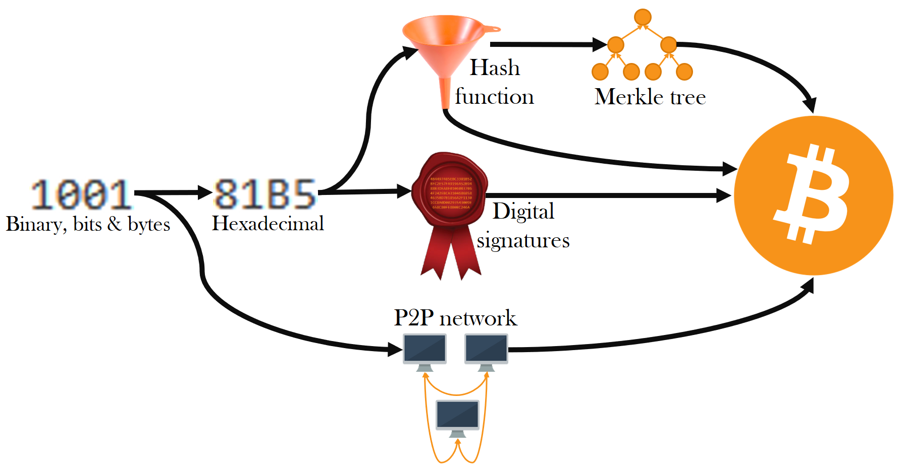

# Blockchain-course

## Bitcoin
- Bitcoin was the first **successful** digital cash without a central intermediary (unlike *Paypal*)
- Bitcoin gave birth to the **blockchain**
- It uses various technologies from the 1990's and 2000's to make that digital cash work
- To understand the blockchain, you'll hence need some pre-requisite knowledge. This is expressed in the following table:

   | Target knowledge       | Pre-requisite 1        | Pre-requisite 2    | Pre-requisite 3      | Pre-requisite 4 |
   | ---------------------- | ---------------------- | ------------------ | -------------------- | --------------- |
   | Bitcoin                | Hash function          | Digital signatures | Peer-to-peer network | Merkle tree     |
   | Merkle tree            | Hash function          |
   | Digital signatures     | Hexadecimal            |
   | Hash function          | Hexadecimal            |
   | Hexadecimal            | Binary, bits and bytes |
   | Peer-to-peer network   |
   | Binary, bits and bytes |

From this table is generated a nice diagram for you to decide where to start but actually diggint in the Bitcoin protocol.

You can therefore start by one of the following:
- [Binary, bits and bytes](BinaryBitsBytes)
- [Peer-to-peer network](PeerToPeerNetwork)